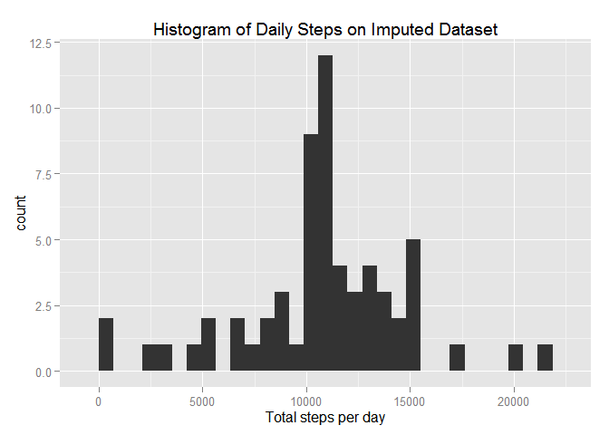
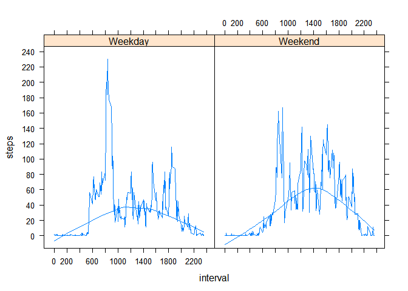

# Reproducible Research: Peer Assessment 1
Deeptendu Bikash Dhar  


## Loading and preprocessing the data

This consists of two steps:

1. Loading the data: We use read.csv() on the zipped file unzipped through unz().

2. Preprocessing the data: We convert the 'date' variable into a Date type using as.Date().


```r
data <- read.csv(unz("activity.zip", "activity.csv"))
data$date <- as.Date(data$date, format="%Y-%m-%d")
```


## What is mean total number of steps taken per day?

Two questions need to be answered:

1. Make a histogram of the total number of steps taken each day.

2. Calculate and report the mean and median total number of steps taken per day.

To get the total number of steps taken each day, we use the dplyr library to group the data by date and summarise using the sum of steps. The resulting table **daily_data** contains 61 observations of 2 variables - date and sum of steps.


```r
library("dplyr")

daily_data <- tbl_df(data) %>% group_by(date) %>% summarise(sum(steps, na.rm=TRUE))
daily_data
```

```
## Source: local data frame [61 x 2]
## 
##          date sum(steps, na.rm = TRUE)
## 1  2012-10-01                        0
## 2  2012-10-02                      126
## 3  2012-10-03                    11352
## 4  2012-10-04                    12116
## 5  2012-10-05                    13294
## 6  2012-10-06                    15420
## 7  2012-10-07                    11015
## 8  2012-10-08                        0
## 9  2012-10-09                    12811
## 10 2012-10-10                     9900
## ..        ...                      ...
```

Then we simply plot the histogram of daily_data using the qplot() function.


```r
library("ggplot2")

qplot(daily_data[[2]], data = daily_data, main = "Histogram of Daily Steps", xlab = "Total steps per day")
```

 

The mean and median total number of steps taken per day can be deduced directly from the daily_data table.


```r
mean(daily_data[[2]])
```

```
## [1] 9354.23
```

```r
median(daily_data[[2]])
```

```
## [1] 10395
```


## What is the average daily activity pattern?

Two questions need to be answered:

1. Make a time series plot (i.e. type = "l") of the 5-minute interval (x-axis) and the average number of steps taken, averaged across all days (y-axis)

2. Which 5-minute interval, on average across all the days in the dataset, contains the maximum number of steps?

To get the average number of steps taken across the 5-minute intervals of the day, we use the dplyr library to group the data by the 5-minute intervals and summarise using the mean of steps. The resulting table **minute_data** contains 288 observations (12 * 24) of 2 variables - interval and mean of steps.


```r
minute_data <- tbl_df(data) %>% group_by(interval) %>% summarise(mean(steps, na.rm=TRUE))
minute_data
```

```
## Source: local data frame [288 x 2]
## 
##    interval mean(steps, na.rm = TRUE)
## 1         0                 1.7169811
## 2         5                 0.3396226
## 3        10                 0.1320755
## 4        15                 0.1509434
## 5        20                 0.0754717
## 6        25                 2.0943396
## 7        30                 0.5283019
## 8        35                 0.8679245
## 9        40                 0.0000000
## 10       45                 1.4716981
## ..      ...                       ...
```

Then we simply plot the histogram of daily_data using the qplot() function. (The equivalent of a type="l" plot is a "line" geom in ggplot).


```r
qplot(minute_data[[1]], minute_data[[2]], geom = "line", main = "Average Steps over Time of Day", xlab = "Time of day (5 minute interval)", ylab = "Average number of steps")
```

 

The maximum number of steps averaged across all days is found to occur in the 5-minute interval starting from 8:35 am:


```r
minute_data[which.max(minute_data[[2]]), 1]
```

```
## Source: local data frame [1 x 1]
## 
##   interval
## 1      835
```


## Imputing missing values

1. Calculate and report the total number of missing values in the dataset (i.e. the total number of rows with NAs).


```r
sum(is.na(data$steps))
```

```
## [1] 2304
```

2. Devise a strategy for filling in all of the missing values in the dataset. The strategy does not need to be sophisticated. For example, you could use the mean/median for that day, or the mean for that 5-minute interval, etc.

We will use the mean of the 5-minute interval forimputation. This means that we can directly use the **minute_data** table created in the earlier section.

3. Create a new dataset that is equal to the original dataset but with the missing data filled in.


```r
imputed_data <- data
for(i in 1:nrow(imputed_data)) {
  if(is.na(imputed_data$steps[i])){
    intv <- imputed_data$interval[i]
    minute_intv <- which(minute_data$interval == intv)
    imputed_data$steps[i] <- as.numeric(minute_data[minute_intv ,2])
  }
}
```

4. Make a histogram of the total number of steps taken each day and Calculate and report the mean and median total number of steps taken per day. Do these values differ from the estimates from the first part of the assignment? What is the impact of imputing missing data on the estimates of the total daily number of steps?


```r
imputed_daily_data <- tbl_df(imputed_data) %>% group_by(date) %>% summarise(sum(steps, na.rm=TRUE))
summary(daily_data)
```

```
##       date            sum(steps, na.rm = TRUE)
##  Min.   :2012-10-01   Min.   :    0           
##  1st Qu.:2012-10-16   1st Qu.: 6778           
##  Median :2012-10-31   Median :10395           
##  Mean   :2012-10-31   Mean   : 9354           
##  3rd Qu.:2012-11-15   3rd Qu.:12811           
##  Max.   :2012-11-30   Max.   :21194
```

```r
summary(imputed_daily_data)
```

```
##       date            sum(steps, na.rm = TRUE)
##  Min.   :2012-10-01   Min.   :   41           
##  1st Qu.:2012-10-16   1st Qu.: 9819           
##  Median :2012-10-31   Median :10766           
##  Mean   :2012-10-31   Mean   :10766           
##  3rd Qu.:2012-11-15   3rd Qu.:12811           
##  Max.   :2012-11-30   Max.   :21194
```

```r
qplot(imputed_daily_data[[2]], data = imputed_daily_data, main = "Histogram of Daily Steps on Imputed Dataset", xlab = "Total steps per day")
```

 

The values differ from the estimates in the first part of the assignment in that there is an **increase** in the steps. There is a marked increase in the count of steps around the 10,000-step band, as opposed to the high around the zero-step band. Also, both the mean (9354 -> 10766) and median (10395 -> 10766) total number of steps taken per day increases as can be seen below:


```r
mean(imputed_daily_data[[2]])
```

```
## [1] 10766.19
```

```r
median(imputed_daily_data[[2]])
```

```
## [1] 10766.19
```

## Are there differences in activity patterns between weekdays and weekends?

To understand this, we follow a two-step approach:

1. Create a factor variable **daytype** with levels "Weekday" and "Weekend". (If the day of the week is "Saturday" or "Sunday" it is "Weekend" else it is "Weekday"). We do this on the imputed_data.


```r
imputed_data$daytype <- as.factor(ifelse(weekdays(imputed_data$date) %in% c("Saturday", "Sunday"), "Weekend", "Weekday"))
```

2. Make a panel plot containing a time series plot of the 5-minute interval and the average number of steps taken, averaged across all weekday days or weekend days.To understand the pattern difference, we also fit a smooth line to the plot.


```r
imputed_minute_data <- tbl_df(imputed_data) %>% group_by(interval, daytype) %>% summarise_each(funs(mean))
imputed_minute_data <- tbl_df(imputed_data) %>% group_by(interval, daytype) %>% summarise_each(funs(mean))
library("lattice")
xyplot(steps ~ interval | daytype, data = imputed_minute_data, type=c("l", "smooth"), scales=list(tick.number=10))
```

 

Several interesting observations come out from this plot:

1. The high activity level observed on weekdays in the morning (8 to 9 am) is absent on weekends. People are lazy to start the day

2. However, as the day goes on, the average activity is higher than in the weekdays. That is, people seem to incorporate a higher level of exercise but it is distributed throughout the day as per their 'home work' commitments.

3. In the smoothed fit, the maximum mean number of steps is around 40 ocurring at around 11 am on weekdays; whereas the number is around 60 on weekends and they occur on or after noon.
